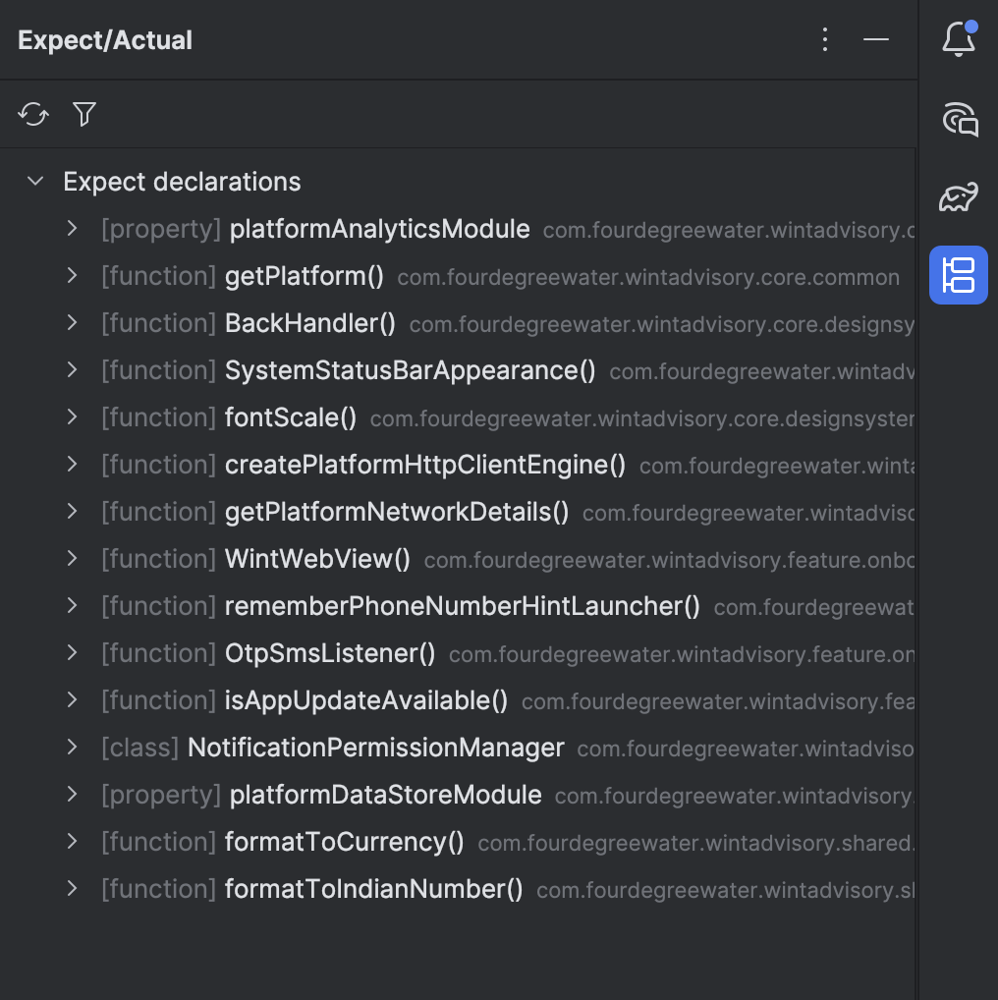

# KMP Expect/Actual Tracker

> A project-wide coverage dashboard for Kotlin Multiplatform `expect`/`actual` declarations — surfaced as an IntelliJ / Android Studio tool window.

[](https://github.com/abhijeetk97/kmp-expect-actual-tracker/actions/workflows/build.yml)
[](https://github.com/abhijeetk97/kmp-expect-actual-tracker/releases)
[](LICENSE)

---



---

## What problem does this solve?

In a Kotlin Multiplatform project, the Kotlin compiler guarantees that every `expect` declaration has a matching `actual` — but only for the targets you are **currently building**. When you add a new platform target, or when a large codebase has `expect` declarations spread across many modules, there is no single view that tells you:

- Which `expect` declarations already have an `actual` on every platform?
- Which ones are missing an `actual` on Android, or iOS, or JVM?

This plugin fills that gap. It scans your project, pairs every `expect` with its `actual` implementations by fully-qualified name, and presents a **per-platform coverage matrix** directly inside your IDE — without leaving your editor.

> This is not a duplicate of what the compiler does. The compiler enforces correctness at build time for one target at a time. This plugin gives you a **project-wide dashboard** across all platforms at a glance.

---

## Features

- **Coverage tree** — every `expect` declaration listed as a parent node; each platform as a child with ✓ (covered) or ✗ missing (red)
- **Coverage badge** — `[2/3 platforms]` count shown inline next to each expect
- **Incomplete-only filter** — hide fully-covered expects with one click; no re-scan triggered
- **Double-click navigation** — jump to the `expect` or directly to an `actual` on any platform
- **Smart loading states** — animated spinner during scan; actionable messages for non-KMP projects and unsynced Gradle projects
- **Generated-file exclusion** — Compose Multiplatform resource accessors and other code-gen output are filtered out automatically

---

## Installation

### From the JetBrains Marketplace *(coming soon)*

1. Open **Settings → Plugins → Marketplace**
2. Search for **KMP Expect/Actual Tracker**
3. Click **Install** and restart the IDE

### Install from disk (current builds)

1. Download the latest `.zip` from the [Releases](https://github.com/abhijeetk97/kmp-expect-actual-tracker/releases) page
2. Open **Settings → Plugins → ⚙ → Install Plugin from Disk…**
3. Select the downloaded `.zip`
4. Restart the IDE

### Compatibility

| IDE | Minimum version |
|-----|----------------|
| IntelliJ IDEA | 2024.3 (build 243) |
| Android Studio | Ladybug (2024.2) or later |

---

## Usage

1. Open a Kotlin Multiplatform project and ensure **Gradle sync** has completed
2. Open the **Expect/Actual** tool window (right sidebar, or **View → Tool Windows → Expect/Actual**)
3. The tree populates automatically once indexing finishes
4. Use the **↺ Refresh** button to re-scan after adding new declarations
5. Use the **⊟ Filter** button to show only incomplete expects

---

## Architecture

```
FileTypeIndex (project scope)
    │  one pass over all .kt files
    ▼
ExpectActualScanner          ← pure PSI traversal, no semantic analysis
    │  hasModifier(EXPECT_KEYWORD / ACTUAL_KEYWORD)
    │  FQ-name pairing
    │  module-name → platform heuristic
    ▼
CoverageService              ← project-level Light Service (@Service Level.PROJECT)
    │  @Volatile cache; invalidated on Refresh
    ▼
ExpectActualToolWindowFactory
    │  ReadAction.nonBlocking().inSmartMode()  ← off the EDT, PSI-safe
    │  JBLoadingPanel spinner
    ▼
Tree (Coverage + PlatformNode rows)
```

**Key design decisions:**

- **PSI-only, no Analysis API** — `hasModifier(KtTokens.EXPECT_KEYWORD)` is syntactic; it works identically in both K1 and K2 Kotlin plugin modes and requires no semantic resolution.
- **FQ-name matching** — expects and actuals are paired by fully-qualified name. Simple, fast, and analysis-free.
- **Read-action threading** — all PSI access runs inside `ReadAction.nonBlocking().inSmartMode()` on a background thread so the UI never freezes.
- **CoverageService cache** — a single `@Volatile` field avoids re-scanning on every tool window repaint. The inspection (issue #5) and the tool window share the same cached result.

---

## Known Limitations

| Limitation | Impact | Planned fix |
|-----------|--------|-------------|
| FQ-name collision on overloaded `expect` functions | Two `expect fun foo()` with different signatures share the same FQ name; one shadows the other in the coverage map | [Issue #14](https://github.com/abhijeetk97/kmp-expect-actual-tracker/issues/14) — Kotlin Analysis API |
| `knownPlatforms` is a project-wide union | If you add a new target but haven't written any `actual`s yet, it doesn't appear as "missing" | [Issue #15](https://github.com/abhijeetk97/kmp-expect-actual-tracker/issues/15) — source-set graph traversal |
| Platform detection uses module-name heuristics | Unusual module naming may misclassify a platform | [Issue #12](https://github.com/abhijeetk97/kmp-expect-actual-tracker/issues/12) — KotlinFacet-based detection |
| Android modules require the Android plugin | Running the sandbox on IntelliJ Community (no Android plugin) hides Android source sets | Expected — works correctly in Android Studio |

---

## Roadmap

| Issue | Feature |
|-------|---------|
| [#5](https://github.com/abhijeetk97/kmp-expect-actual-tracker/issues/5) | `MissingActualInspection` — inline editor warnings |
| [#6](https://github.com/abhijeetk97/kmp-expect-actual-tracker/issues/6) | Auto-refresh on PSI edits (debounced) |
| [#8](https://github.com/abhijeetk97/kmp-expect-actual-tracker/issues/8) | Persist settings (ignored declarations, custom platform labels) |
| [#11](https://github.com/abhijeetk97/kmp-expect-actual-tracker/issues/11) | Export coverage report as HTML/CSV |
| [#14](https://github.com/abhijeetk97/kmp-expect-actual-tracker/issues/14) | Kotlin Analysis API for precise overload handling |

---

## Contributing

See [CONTRIBUTING.md](CONTRIBUTING.md) for setup instructions, architecture notes, and contribution guidelines.

---

## License

[MIT](LICENSE)
